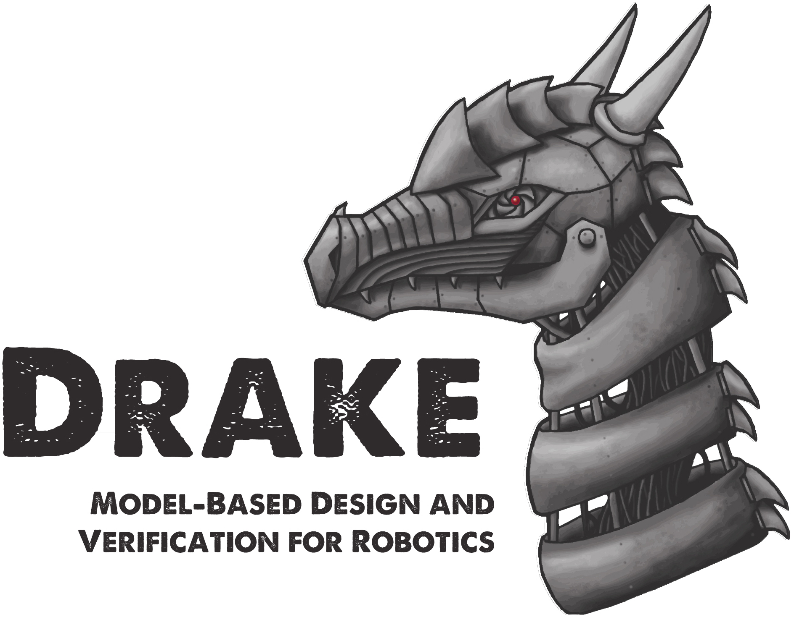

********
Overview
********

Drake ("dragon" in Middle English) is a C++ toolbox started by the
`Robot Locomotion Group <http://groups.csail.mit.edu/locomotion/>`_ at the MIT Computer Science and Artificial Intelligence Lab (CSAIL).  The :doc:`development team has now
grown significantly </credits>`, with core development led by the `Toyota Research Institute`_.
It is a collection of tools for analyzing the dynamics of our robots and building control systems for them, with a heavy emphasis on optimization-based design/analysis.

While there are an increasing number of simulation tools available for robotics, most of them function like a black box: commands go in, sensors come out.  Drake aims to simulate even very complex dynamics of robots (e.g. including friction, contact, aerodynamics, ...), but always with an emphasis on exposing the structure in the governing equations (sparsity, analytical gradients, polynomial structure, uncertainty quantification, ...) and making this information available for advanced planning, control, and analysis algorithms.  Drake provides interfaces to high-level languages (MATLAB, Python, ...) to enable rapid-prototyping of new algorithms, and also aims to provide solid open-source implementations for many state-of-the-art algorithms.  Finally, we hope Drake provides many compelling examples that can help people get started and provide much needed benchmarks.   We are excited to accept user contributions to improve the coverage.

********
Features
********

.. raw:: html

    <table align="center">
        <tr>
            <td style="transform: rotate(270deg);
                       -ms-transform:rotate(270deg); /* IE 9 */
                       -moz-transform:rotate(270deg); /* Firefox */
                       -webkit-transform:rotate(270deg); /* Safari and Chrome */
                       -o-transform:rotate(270deg)"
                width="10">Core</td>
            <td style="text-align:center;vertical-align:top" width=200
            height=150>
                <a href="https://drake.mit.edu/doxygen_cxx/group__systems.html">Modeling Dynamical Systems</a>
                

                
            </td>
            <td rowspan=7 style="border-right:1px solid black"></td>
            <td style="text-align:center;vertical-align:top" width=200>
                
                

                
            </td>
            <td rowspan=7 style="border-right:1px solid black"></td>
            <td style="text-align:center;vertical-align:top" width=200>
                <a href="https://drake.mit.edu/doxygen_cxx/group__multibody.html">Multibody Kinematics and Dynamics</a>
                

                
            </td>
        </tr>
        <tr>
            <td></td>
            <td style="border-bottom:1px solid black" colspan="100%"></td>
        </tr>
        <tr align="center">
            <td></td>
            <td style="text-align:center;vertical-align:top" width=200
            height=30>
            <a href="https://drake.mit.edu/doxygen_cxx/group__algorithms.html">Algorithms</a></td>
            <td style="text-align:center;vertical-align:top">
            <a href="https://drake.mit.edu/doxygen_cxx/namespacedrake_1_1examples.html">Examples</a></td>
            <td style="text-align:center;vertical-align:top"><a
            href="gallery.html">Gallery</a></td>
        </tr>
    </table>

We hope you find this tool useful.  Please see :ref:`getting_help` if you wish
to share your comments, questions, success stories, or frustrations.  And please contribute your best bug fixes, features, and examples!

************
Citing Drake
************

If you would like to cite Drake in your academic publications, we suggest the following BibTeX citation::

	@misc{drake,
	 author = "Russ Tedrake and the Drake Development Team",
	 title = "Drake: Model-based design and verification for robotics",
	 year = 2019,
	 url = "https://drake.mit.edu"
	}

****************
Acknowledgements
****************

The Drake developers would like to acknowledge significant support from the `Toyota Research Institute`_, `DARPA <http://www.darpa.mil/>`_, the `National Science Foundation <https://nsf.gov/>`_, the `Office of Naval Research <http://www.onr.navy.mil/>`_, `Amazon.com <https://www.amazon.com/>`_, and `The MathWorks <http://www.mathworks.com/>`_.

.. _`Toyota Research Institute`: http://tri.global

**********
Next steps
**********

.. toctree::
   :maxdepth: 1

   installation
   gallery
   getting_help
   API Documentation (C++) <doxygen_cxx/index.html#://>
   API Documentation (Python) <pydrake/index.html#://>
   GitHub <https://github.com/RobotLocomotion/drake>
   developers
   credits

********************************************
Using Drake from other Programming Languages
********************************************
.. toctree::
		:maxdepth: 1

		python_bindings
		julia_bindings
		matlab_bindings

