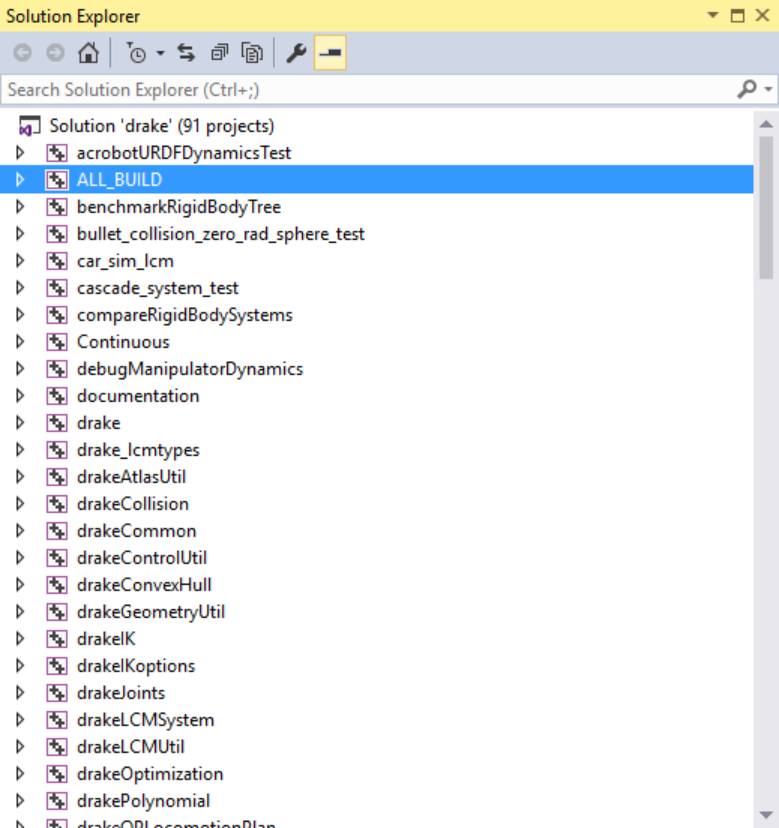

.. _doxygen-instructions:

********************
Doxygen Instructions
********************

This section contains instructions on how to use
`Doxygen <http://www.stack.nl/~dimitri/doxygen/>`_ with Drake.

.. _doxygen-style-guide:

Doxygen Style Guide
===================

Coming soon. See issue
`#2051 <https://github.com/RobotLocomotion/drake/issues/2051>`_ and PR
`#2359 <https://github.com/RobotLocomotion/drake/pull/2359>`_.

.. _doxygen-generation:

Doxygen Website Generation
==========================

There are at least two ways to generate Drake's Doxygen website. The first is
using the command line, and the second through Microsoft Visual Studio.

.. _doxygen-generation-command-line:

Using the Command Line
----------------------

To build the documentation via the command line, execute::

    $ cd [build artifacts directory]
    $ make documentation

To view the generated Doxygen website, open the following file using your
favorite web browser::

    [build artifacts directory]/doc/doxygen_cxx/html/index.html

If you're building Drake in-source, the ``[build artifacts directory]`` is
typically ``drake-distro/drake/pod-build/``. If you're building Drake
out-of-source, the ``[build artifacts directory]`` is typically
``drake-build/drake``.

.. _doxygen-generation-visual-studio:

Using Microsoft Visual Studio
-----------------------------

In Visual Studio, there is a ``documentation`` target that's visible through the
Solution Explorer, as shown below:

To build the documentation, simply select and build the ``documentation`` target
in the IDE. Note that in Microsoft Visual Studio, the ``documentation`` target
is not built when building the other targets, meaning there is one less reason
to disable the ``documentation`` target.

