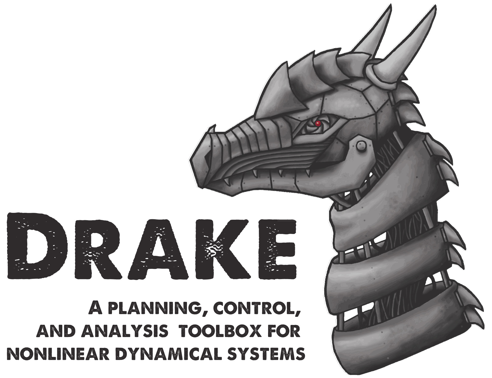

.. Build the drake documentation using
   pip install Sphinx
   make html (from this doc directory)

.. image:: images/under_construction.png
	:width: 39%

******************************
Important Note (October, 2016)
******************************

Drake is currently undergoing a major renovation, with all of the core
libraries moving into C++.  The examples will move and the existing APIs will
change.  During this time, we recommend that users either engage deeply
(contributing examples/tests which provide coverage of your use cases) or wait
for a few months until the APIs have stabilized.  For a stable release, consider
checking out `this SHA <https://github.com/RobotLocomotion/drake/tree/last_sha_with_windows_support>`_.

This change is fantastically exciting -- Drake is becoming a mature and powerful
tool.  Thank you for your patience.

********
Overview
********

Drake ("dragon" in Middle English) is a toolbox started by the
`Robot Locomotion Group <http://groups.csail.mit.edu/locomotion/>`_ at the MIT Computer Science and Artificial Intelligence Lab (CSAIL).  The :doc:`development team has now
grown significantly </credits>`, with core development led by the `Toyota Research Institute <http://tri.global/>`__.
It is a collection of tools for analyzing the dynamics of our robots and building control systems for them in MATLAB and C++, with a heavy emphasis on optimization-based design/analysis.

While there are an increasing number of simulation tools available for robotics, most of them function like a black box: commands go in, sensors come out.  Drake aims to simulate even very complex dynamics of robots (e.g. including friction, contact, aerodynamics, ...), but always with an emphasis on exposing the structure in the governing equations (sparsity, analytical gradients, polynomial structure, uncertainty quantification, ...) and making this information available for advanced planning, control, and analysis algorithms.  Drake provides interfaces to high-level languages (MATLAB, Python, ...) to enable rapid-prototyping of new algorithms, and also aims to provide solid open-source implementations for many state-of-the-art algorithms.  Finally, we hope Drake provides many compelling examples that can help people get started and provide much needed benchmarks.   We are excited to accept user contributions to improve the coverage.

Here is a quick summary of capabilities:

* Simulation
	* Rigid-body dynamics including contact/collisions (hybrid+LCP) and kinematic loops
	* Basic aerodynamics/fluid dynamics
	* Sensor models (lidar, depth camera, imu, contact force/torque; cameras coming soon)
	* Hand-derived models for many canonical control dynamical systems
	* Easily add your own models/components
	* Some support for stochastic models
	* For all of the above we aim to expose sparsity and provide analytical gradients / symbolic analysis
	* Primary limitations: code is optimized for analysis / planning / control design (as opposed to speed, generality)
* Analysis
	* Find fixed points / trim conditions
	* Local stability/sensitivity analysis (via linearization / semi-definite programming)
	* Region of attraction analysis using sums-of-squares optimization
	* Finite-time verification (e.g. forward/backward reachability analysis)
	* Uncertainty quantification (coming soon)
* Planning
	* Rich/fast inverse kinematics
	* Trajectory optimization (kinematic and dynamic) -- many state-of-the-art algorithms here
	* Basic RRT/RRT* functionality
	* Gait planning for walking robots
	* Grasp optimization for manipulation
	* Feedback motion planning
	* Huge, rich library of constraints used by all of the above
* Feedback Control Design
	* LQR design for fixed-points / along trajectories
	* Sums-of-squares-based feedback design
	* Quadratic programming whole-body control for humanoids
	* Value iteration algorithms (for low dimensional systems)
* State Estimation (coming soon)
	* Recursive filter design (Kalman Filters, Luenberger observers)
	* "Smoothing" estimators for nonlinear systems
* System Identification (coming soon)
	* Least-squares "equation error" minimization for rigid body systems (with automatic extraction of identifiable lumped parameters)
	* Nonlinear "simulation error" minimization
* Many examples / benchmarks / model systems
	* Acrobot, Cart-Pole, Bouncing balls, ...
	* Quadrotors and Fixed-Wing UAVs
	* Walking Robots
	* Manipulation
	* Humanoids (most notably including the bulk of our codebase for Atlas from `MIT's entry in the DARPA Robotics Challenge <http://drc.mit.edu>`_)
	* Wheeled vehicle models (coming soon)
* Other
	* Advanced visualization tools, including parts of our user interface from the DARPA Robotics Challenge (with more coming soon)
	* Hardware / network interfaces

Most of these models/tools are described in `the companion textbook from an MIT course/MOOC <https://people.csail.mit.edu/russt/underactuated/underactuated.html?chapter=drake>`_.  We've also recently started populating the :doc:`gallery` (contributions welcome!).

We hope you find this tool useful.   Please engage us `via github issues <https://github.com/RobotLocomotion/drake/issues>`_ with comments, questions, success stories, and frustrations.  And please contribute your best bug fixes, features, and examples!

Citing Drake
============

If you would like to cite Drake in your academic publications, we suggest the following BibTeX citation::

	@misc{drake,
	 author = "Russ Tedrake and the Drake Development Team",
	 title = "Drake: A planning, control, and analysis toolbox for nonlinear dynamical systems",
	 year = 2016,
	 url = "http://drake.mit.edu"
	}

Acknowledgements
================

The Drake developers would like to acknowledge significant support from the `Toyota Research Institute <http://tri.global>`_, `DARPA <http://www.darpa.mil/>`_, the `National Science Foundation <https://nsf.gov/>`_, the `Office of Naval Research <http://www.onr.navy.mil/>`_, `Amazon.com <https://www.amazon.com/>`_, and `The MathWorks <http://www.mathworks.com/>`_.

Next steps
==========

.. toctree::
   :maxdepth: 1

   gallery
   installation
   Introduction and Examples <http://underactuated.csail.mit.edu/underactuated.html?chapter=drake>
   design
   developers
   Doxygen (C++) <doxygen_cxx/index.html#://>
   Doxygen (MATLAB) <doxygen_matlab/index.html#://>
   URDF Reference <urdf/drakeURDF.html#://>
   faq
   issues
   video_tutorials
   Mailing list <http://mailman.mit.edu/mailman/listinfo/drake-users>
   credits
   GitHub <https://github.com/RobotLocomotion/drake>
