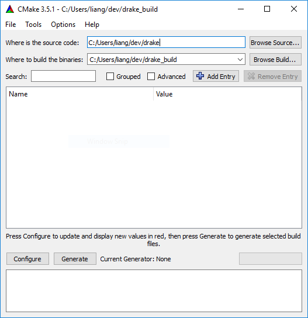
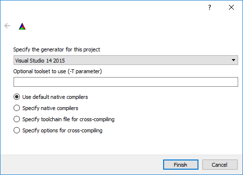
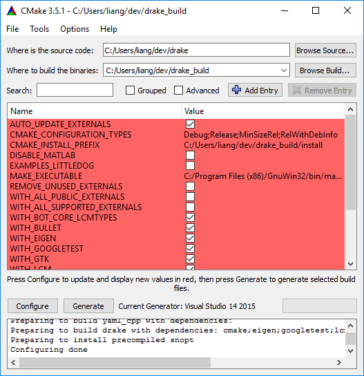
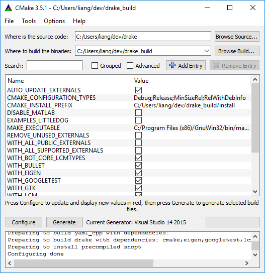

.. _windows-installation-instructions:

***************************************
Drake Windows Installation Instructions
***************************************

.. contents:: `Table of contents`
   :depth: 3
   :local:

Install Prerequisites
=====================

.. _windows-installation-matlab:

Enabling MATLAB Support (Optional)
----------------------------------

If you want to use the MATLAB-powered elements of Drake, be sure to:

1. Follow the instructions `here <from_source>`_ to setup MATLAB.
2. Within MATLAB, execute ``mex -setup`` to set up a compatible compiler (e.g., `Microsoft Visual Studio 2015 Community <http://visualstudio.com>`_).
3. Install the `VC++ component <https://msdn.microsoft.com/en-us/library/60k1461a.aspx>`_.
4. Add MATLAB to your system path.

.. _windows-installation-java:

Git
---

Download and install `Git for Windows <https://git-scm.com/download/win>`_. Note that this includes a ``bash`` shell, which we will use below.

Java Development Kit (JDK)
--------------------------

Download and install `Java's JDK <http://www.oracle.com/technetwork/java/javase/downloads/>`_. Then add the executable directory, e.g. ``C:\Program Files\Java\jdk[version]\bin``, to your `system path <http://www.java.com/en/download/help/path.xml>`_.

.. _windows-installation-cmake:

CMake
-----

CMake 3.5 or higher is required.

Please visit the `CMake Download Page`_ to obtain a Windows binary.
Say yes when the CMake installer offers to add itself to your system path.
Verify that ``C:\Program Files (x86)\CMake\bin`` is added to your path.
This can be done by opening a command prompt by typing::

    $ cmd

and executing::

    $ echo %PATH%

.. _`CMake Download Page`: https://cmake.org/download/

.. _windows-installation-gnu:

Make for Windows
----------------------

Download and install `Make for Windows <http://gnuwin32.sourceforge.net/packages/make.htm>`_.  Be sure to add the directory containing the ``make.exe`` executable to your system path. For example, they are typically installed in ``C:\Program Files (x86)\GnuWin32\bin``.

.. _windows-installation-pkg-config:

pkg-config
----------

Download and install `pkg-config-lite <http://sourceforge.net/projects/pkgconfiglite/files/>`_ or another pkg-config win32 implementation of your choosing.  Be sure to add ``[...]\pkg-config-lite-0.28-1\bin`` to your path.

.. _windows-installation-visual-studio:

Microsoft Visual Studio Community 2015
--------------------------------------

Download and install the free `Microsoft Visual Studio Community 2015 <https://www.visualstudio.com>`_. This is a free version of Microsoft Visual Studio.

During the installation process, select the custom install option, then select "Programming Languages / Visual C++".

.. _windows-compilation:

Drake Compilation
=================

Drake can only be compiled out-of-source. Building Drake out-of-source is recommended anyway since it separates compiler artifacts from version controlled files.

.. _windows-obtain-source-code:

Obtain the Source Code
----------------------

Open a ``git`` bash shell. Then clone the master branch of Drake's official repository::

    $ cd [source code directory]
    $ git clone https://github.com/RobotLocomotion/drake.git drake-distro

At this point, we recommend you update your ``git remotes`` to avoid accidentally pushing to Drake's official repository as described :ref:`here <git-remote-config>`.

.. _windows-build-directory:

Create Build Directory
----------------------

Create a directory for holding Drake's compiler artifacts::

    $ mkdir -p [build artifacts directory]

.. _windows-configure-build:

Configure Build
---------------

Configure the build system::

    $ cd [build artifacts directory]
    $ cmake-gui [source code directory]/drake-distro

You should see the following ``CMake`` GUI appear:

Click on the "Configure" button. Select the generator you want to use. The two options available are:

1. Visual Studio 14 2015 -- For 32-bit builds
2. Visual Studio 14 2015 Win64 -- For 64-bit builds

The screen shot below shows “Visual Studio 14 2015” being selected, which will compile a 32-bit version of Drake.

Note: An alternative way to select the generator is via the ``CMAKE_FLAGS`` environment variable. To use the 64-bit Visual Studio generator, set ``CMAKE_FLAGS`` to be ``-G "Visual Studio 14 2015 Win64"``. If you want to build 32-bit binaries, use ``-G "Visual Studio 14 2015"``.

Click the “Finish” button. Allow the CMake GUI to analyze all of the options. Once done, you should see the following:

The options all appear red because you haven't actually configured anything yet. Select the options you want. Then click on the "Configure" button again. The options should all appear white as shown below.

Finally, click on “Generate” to produce the make files. You may now close the CMake GUI.

.. _windows-compile-drake:

Compile Drake
-------------

Back in the ``bash`` terminal, start the compilation process. There are many configurations you can compile Drake in. For example, three popular configurations are ``Debug``, ``RelWithDebInfo``, and ``Release``. You specify the mode when compiling Drake, as shown below::

    $ cd [build artifacts directory]
    $ cmake --build . --target ALL_BUILD --config [build configuration]

For example, to compile Drake using build configuration ``RelWithDebInfo``, execute::

    $ cd [build artifacts directory]
    $ cmake --build . --target ALL_BUILD --config RelWithDebInfo

Sit back. Grab a coffee. The compilation process will take a while.

Note that after this initial build is done, if you change Drake's code, you can more quickly recompile by executing::

    $ cd [build artifacts directory]/drake
    $ cmake --build . --target ALL_BUILD --config [build configuration]

Update PATH Environment Variable
--------------------------------

The compilation process generates a bunch of installed ``.dll`` libraries. You need to add the path to these libraries to your ``PATH`` environment variable:

* ``[build artifacts directory]\install\lib``

Test Compilation Results
------------------------

To verify Drake was successfully compiled, run the unit tests::

    $ cd [build artifacts directory]/drake
    $ ctest -VV -C [build mode]

You can also run a specific unit test::

    $ cd [build artifacts directory]/drake
    $ ctest -VV -C [build mode] -R [name of unit test]

For more details on unit testing, see :ref:`here <unit-test-instructions>`.

.. When you're done with these platform-specific steps, return to :doc:`from_source` to complete and test your installation.

Other Handy Notes
=================

To compile Fortran pods (e.g. ``avl``, ``xfoil``, ...), I installed Intel Parallel Studio XE Cluster (for ``ifort`` compiler, requires a license).
Would have loved to use ``gfortran``, but my understanding is that it is fundamentally not compatible with the rest of the visual studio building tools.

To disable the debug question every time MATLAB crashes running unit tests, execute the following from a terminal::

	$ reg add "HKCU\Software\Microsoft\Windows\Windows Error Reporting\ExcludedApplications" /v "MATLAB.exe" /t REG_SZ /d 1 /f
	$ reg add "HKCU\Software\Microsoft\Windows\Windows Error Reporting" /v "DontShowUI" /t REG_DWORD /d 1 /f
