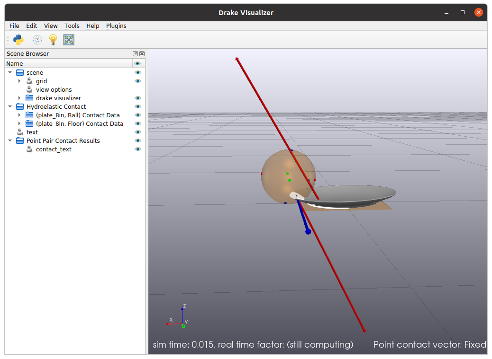

<h1>Rolling ball on a dinner plate on a floor</h1>

This is an example for using hydroelastic contact model with a non-convex
geometry loaded from an SDFormat file of a dinner plate.
The ball, the plate, and the floor are compliant, rigid, and compliant
hydroelastic. The plate-ball, ball-floor, and plate-floor contacts are 
rigid-compliant, compliant-compliant, and rigid-compliant.
Hydroelastic contact model can work with non-convex shapes accurately
without resorting to their convex hulls.

In the source code, this example shows how to set up bodies by loading SDFormat
files and also calling C++ APIs.



<h2>Preliminary step: start the visualizer </h2>

```
bazel run //tools:meldis -- --open-window &
```

<h2>Run with Hydroelastic</h2>

By default, this example uses hydroelastic contact model.
It is intentionally run at 0.1 realtime rate, so we can appreciate dynamics
in the visualization. Otherwise, the simulation is too fast for human eyes.

```
bazel run //examples/hydroelastic/ball_plate:ball_plate_run_dynamics
```

If it's too fast to see, you can slow it down further like this:
```
bazel run //examples/hydroelastic/ball_plate:ball_plate_run_dynamics \
-- --simulator_target_realtime_rate=0.01
```

<h2>Spin the ball</h2>

We want to see dynamics of the ball-plate and the plate-floor contacts.
We use zero for the friction coefficients (`--friction_coefficient`) to make
it very slippery.
We use a very large initial angular velocity of the ball (`--wz`; `w` for `ω`)
around its Z-axis to make it spin very fast.

```
bazel run //examples/hydroelastic/ball_plate:ball_plate_run_dynamics \
-- --friction_coefficient=0 --simulation_time=2.5 \
--simulator_target_realtime_rate=0.1 \
--wz=10000
```

The example command above intentionally specifies very low real-time rate of
0.1, so we can see it easier.
On a good computer, it can run at real-time rate about 1.0.

<h2>Use polygon or triangle contact surfaces</h2>

By default, this example uses polygon contact surfaces. The option
`--contact_surface_representation=triangle` specifies triangle contact surfaces:
```
bazel run //examples/hydroelastic/ball_plate:ball_plate_run_dynamics \
-- --simulator_target_realtime_rate=0.01 \
--contact_surface_representation=triangle
```

<h2>Run with point contact model</h2>

```
bazel run //examples/hydroelastic/ball_plate:ball_plate_run_dynamics \
-- --contact_model=point --simulation_time=120.0 \
--simulator_target_realtime_rate=1.0
```

The option `--contact_model=point` selects the point contact model.
Notice the unphysical oscillation of the dinner plate that does not
dissipate energy despite the very long simulated time specified by
`--simulation_time=120.0`.

Compared to hydroelastic contact, the point contact has to pick one
point from each contact patch.
Since the contact patch between the dinner plate and the floor is quite large,
the chosen point keeps oscillating on the patch.
The option `--simulator_target_realtime_rate=1.0` slows it down enough for
human eyes to see.

<h2>Other Options</h2>
There are other command-line options that you can use. Use `--help` to see
the list. For example, you can set Hunt & Crossley dissipation of the ball,
friction coefficient of the ball, initial position and velocity of the ball,
etc.

```
bazel run //examples/hydroelastic/ball_plate:ball_plate_run_dynamics \
-- --help
```
