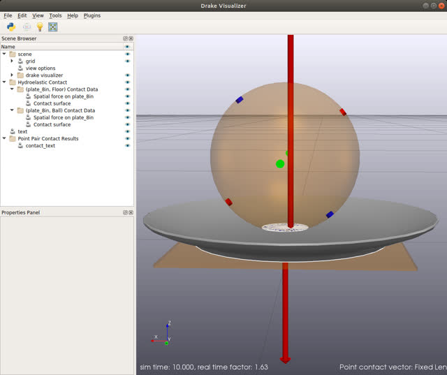
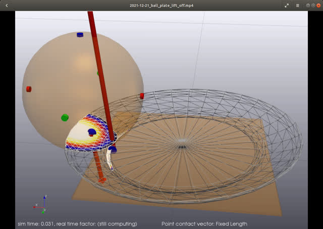
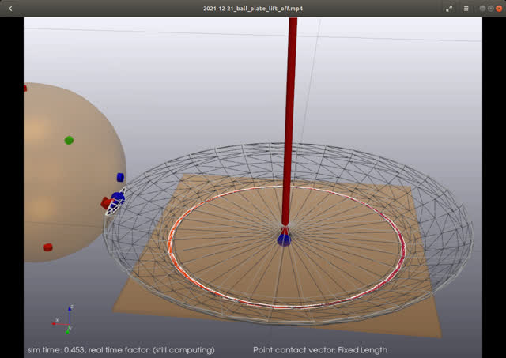
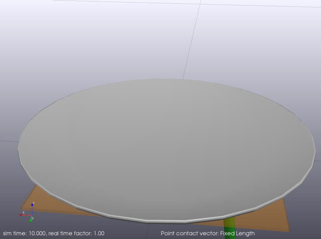
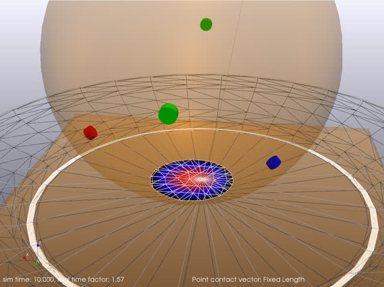
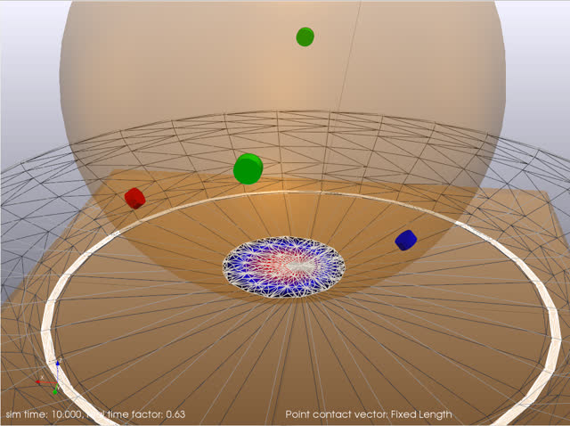

<h1>Rolling ball on a dinner plate on a floor</h1>

This is an example for using hydroelastic contact model with a rigid body
loaded from an SDFormat file. The rigid object is a non-convex dinner plate.
Hydroelastic contact models can work with the non-convex shape accurately
without resorting to its convex hull.



<h2> Preliminary Step: drake_visualizer </h2>

```
bazel run //tools:drake_visualizer &
```

<h2>Run with default parameters</h2>
By default, it runs with HydroelasticWithFallback,
runs as fast as possible, uses dicrete systems, and uses polygon contact 
surfaces. We will explain these options later.
```
bazel run //examples/hydroelastic/ball_plate:ball_plate_run_dynamics
```

<h2>Run in real time if possible</h2>
If the simulation is already faster than realtime, you can slow the 
visualization down to show animation in realtime.
Otherwise, some simulation might be too fast to watch.
```
bazel run //examples/hydroelastic/ball_plate:ball_plate_run_dynamics \
-- --simulator_target_realtime_rate=1.0
```

<h2>Run hydroelastic contact with point-contact fall back</h2>
Use hydroelastic contact model as much as possible (at the time of this 
writing, only rigid-compliant contact is supported in hydroelastics).
If there are non-supported contact pairs (e.g., rigid-rigid contact),
it will use point contact model for those pairs.
```
bazel run //examples/hydroelastic/ball_plate:ball_plate_run_dynamics \
-- --contact_model=HydroelasticWithFallback
```
We expect this mode to be the most useful.

<h2>Run with hydroelastic contact model only</h2>
Use hydroelastic contact on all contact pairs.
Since both the ball and the floor are compliant hydroelastics, if they
collide, the simulation will crash. In rare circumstances, this could 
happen if initially the ball moves downward so fast that the ball 
penetrates all the way through the dinner plate to touch the floor.

At the time of this writing, this command runs fine.
```
bazel run //examples/hydroelastic/ball_plate:ball_plate_run_dynamics \
-- --contact_model=hydroelastic
```
Then, adjusting the ball's initial translational velocity in the z-axis
to -5 m/s (5 m/s downward), it crashes.
```
bazel run //examples/hydroelastic/ball_plate:ball_plate_run_dynamics \
-- --contact_model=hydroelastic --vz=-5
```
If we use `HydroelasticWithFallback` instead, it will run fine.
The ball moves downward very fast to touch the dinner plate briefly
and continue to fall down. This command also slows down the visualization,
so you can appreciate the impact of the ball on the plate.
```
bazel run //examples/hydroelastic/ball_plate:ball_plate_run_dynamics \
-- --contact_model=HydroelasticWithFallback --vz=-5 \
--simulator_target_realtime_rate=0.1
```



<h2>Run with point contact model</h2>
The ball will fall from the plate because the point contact model uses
the convex hull of the dinner plate, so the concavity of the plate cannot
prevent the ball from falling. You should run it in realtime.
Otherwise, the animation is too fast, and you might not even see the ball.
```
bazel run //examples/hydroelastic/ball_plate:ball_plate_run_dynamics \
-- --simulator_target_realtime_rate=1.0 --contact_model=point
```
Notice the unphysical oscillation of the dinner plate that does not
dissipate energy. This is how it looks at the end:



<h2>Run with continuous system</h2>
By default, it runs with the discrete system.
You can use the continuous system by setting `mbp_dt` to 0.
```
bazel run //examples/hydroelastic/ball_plate:ball_plate_run_dynamics \
-- --mbp_dt=0
```
At the time of this writing, the continuous system is quite slow.

<h2>Use polygon or triangle contact surfaces</h2>
By default (`--hydro_rep=poly`), it uses polygon contact surfaces that look 
like 
this:



To show the above picture in `drake_visualizer`, set the dinner plate to 
show as wireframe,
set the threshold `Maximum pressure` in `Hydroelastic contact visualization 
settings` to 5e3, etc.

You can use triangle contact surfaces instead by:
```
bazel run //examples/hydroelastic/ball_plate:ball_plate_run_dynamics \
-- --hydro_rep=tri
```
It will run slower and look like this:

