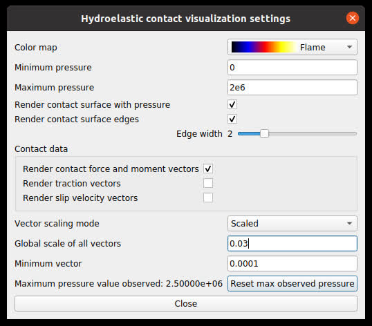
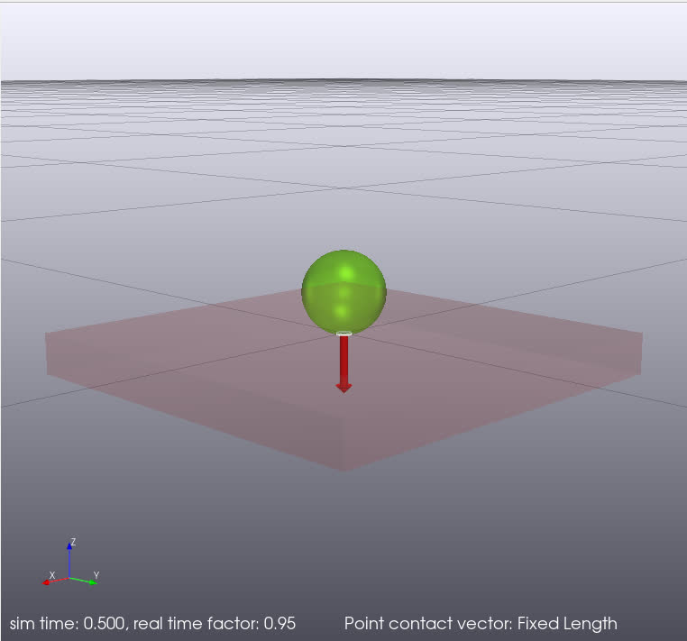
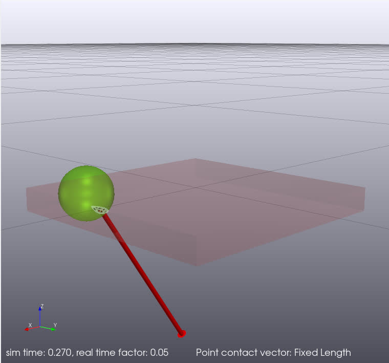

# Ball and Paddle in Python

This is a simple example of using the hydroelastic contact model in Python.
The example drops a compliant-hydroelastic ball on a compliant-hydroelastic
paddle (represented as a box). The two bodies are defined in SDFormat files.

The compliant paddle is a box of size 20x20x2 cm. It is stationary and 
posed in World frame such that its top surface is on and aligned with the 
World's X-Y plane. The center of its top surface is at World origin.

The compliant ball has radius of 2 cm. By default, it is dropped 
from where its center is 4 cm above the top surface of the paddle.

## Run Drake Visualizer

```
bazel run //tools:drake_visualizer &
```

In `Plugins > Contacts > Configure Hydroelastic Contact Visualization` you
might want to set these:

* Maximum pressure = 2e6
* Vector scaling mode = Scaled
* Global scale of all vectors = 0.03



## Run the example

```
bazel run //examples/hydroelastic/python_ball_paddle:contact_sim_demo_py 
```


## Drop the ball near the paddle's edge

We specify very low `target_realtime_rate` so that we can see it easier.

```
bazel run //examples/hydroelastic/python_ball_paddle:contact_sim_demo_py -- \
--ball_initial_position 0.101 0 0.1 \
--target_realtime_rate=0.05 \
--simulation_time=0.27
```



## Contact at a corner
--ball_initial_position -0.1005 0 0.05