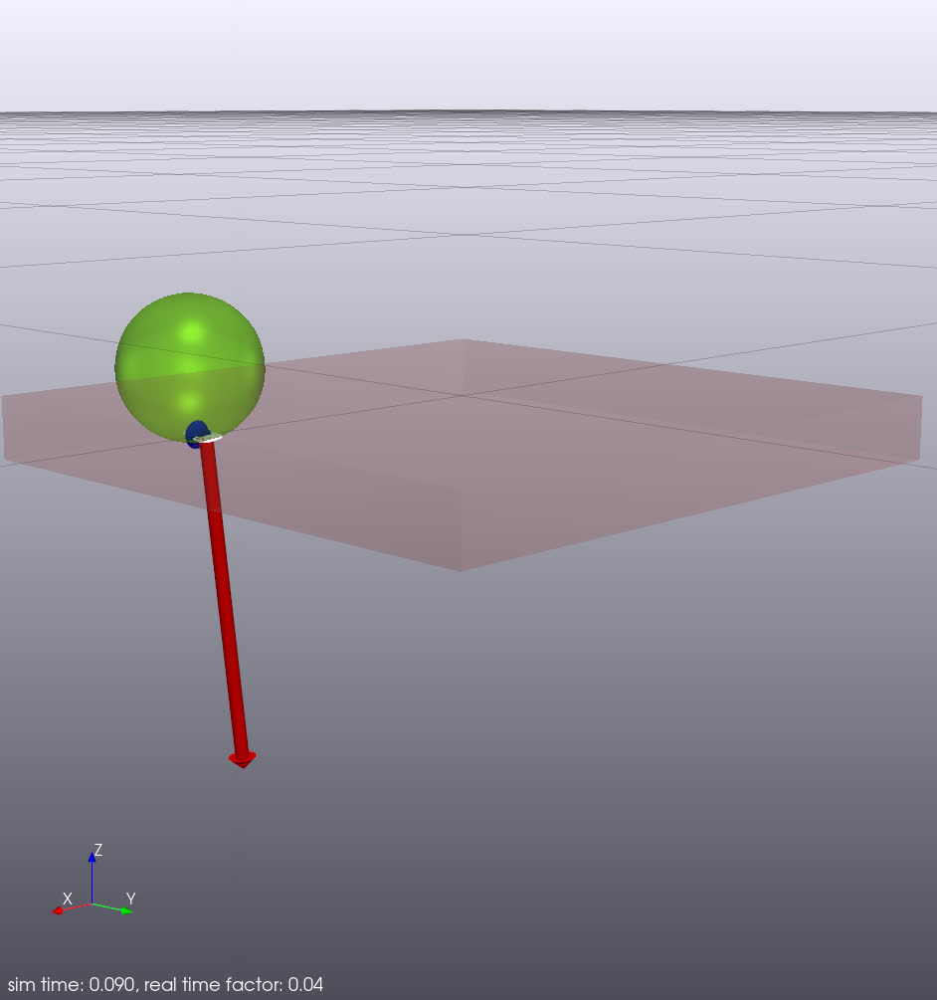
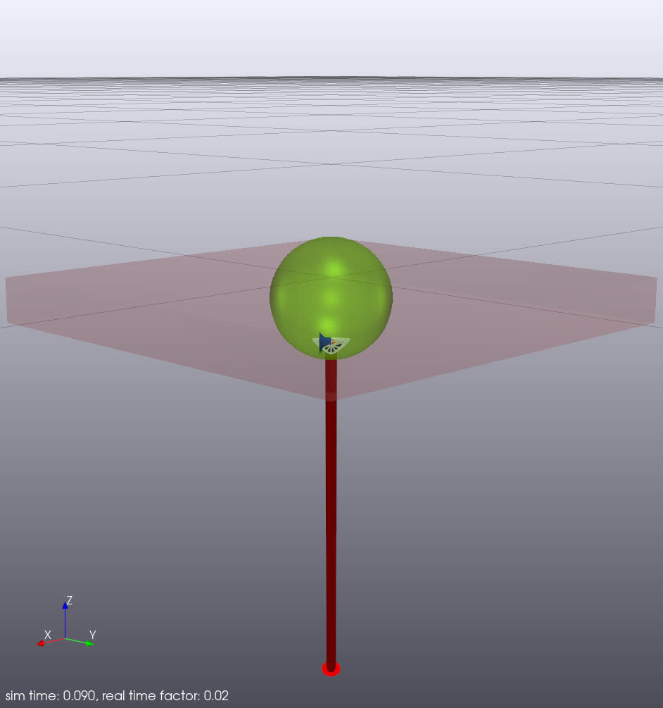

# Ball and Paddle in Python

This is a simple example of using the hydroelastic contact model in Python.
The example drops a compliant-hydroelastic ball on a compliant-hydroelastic
paddle (represented as a box). The two bodies are defined in SDFormat files.

The compliant paddle is a box of size 20x20x2 cm. It is stationary and
posed in World frame such that its top surface is on and aligned with the
World's X-Y plane. The center of its top surface is at World origin.

The compliant ball has radius of 2 cm. By default, it is dropped 4 cm above
the paddle.

## Run the visualizer

```
bazel run //tools:meldis -- --open-window &
```

## Run the example

```
bazel run //examples/hydroelastic/python_ball_paddle:contact_sim_demo_py
```


## Drop the ball near the paddle's edge

We specify very low `target_realtime_rate` so that we can see it easier.

```
bazel run //examples/hydroelastic/python_ball_paddle:contact_sim_demo_py -- \
--ball_initial_position 0.101 0 0.05 \
--target_realtime_rate=0.04 \
--simulation_time=0.09
```




## Drop the ball near the paddle's corner

We specify even lower `target_realtime_rate` so that we can see it easier.

```
bazel run //examples/hydroelastic/python_ball_paddle:contact_sim_demo_py -- \
--ball_initial_position 0.102 0.102 0.05 \
--target_realtime_rate=0.02 \
--simulation_time=0.09
```




## Other Options

There are other command-line options that you can use.
Use `--help` to see the list.
For example, you can use `--contact_model=point` to test point contact.

```
bazel run //examples/hydroelastic/python_ball_paddle:contact_sim_demo_py -- \
--help
```
