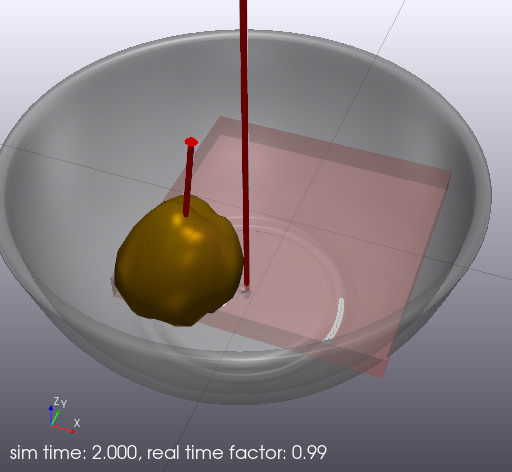
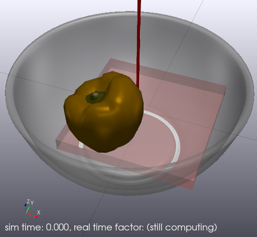
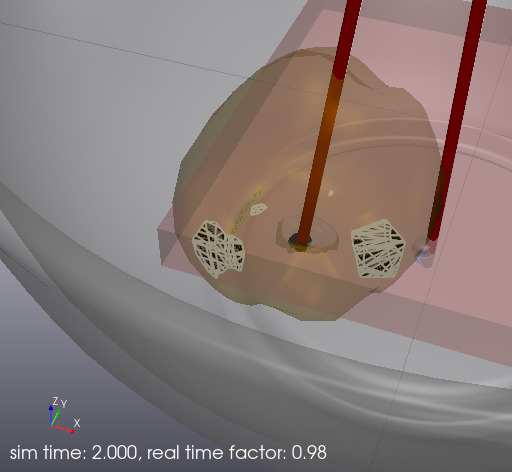

# Drop a bell pepper

This is a simple example of using non-convex meshes with the hydroelastic 
contact model in Python.
The example drops a compliant-hydroelastic yellow bell pepper onto a
rigid-hydroelastic bowl.
The bell pepper is a non-convex compliant mesh.
The bowl is a non-convex rigid mesh.
The table is a compliant box primitive.

## Run the visualizer

```
bazel run //tools:meldis -- --open-window &
```

## Run the example
```
bazel run //examples/hydroelastic/python_nonconvex_mesh:drop_pepper_py
```



## Inspect the initial position
```
bazel run //examples/hydroelastic/python_nonconvex_mesh:drop_pepper_py \
-- --simulation_time=0
```
With `--simulation_time=0`, the simulation stops at the beginning, so we can 
see the initial position of the bell pepper.



## Slow down to observe dynamics
```
bazel run //examples/hydroelastic/python_nonconvex_mesh:drop_pepper_py \
-- --target_realtime_rate=0.1
```
By default, the simulation runs at 1X realtime rate.
With `--target_realtime_rate=0.1`, the simulation slows down ten times, so
we can observe how the bowl rocks back and forth and how the bell pepper 
spins and moves around.

## Inspect the contact surface

After the simulation finishes, in the visualizer adjust the alpha blending to
add transparency.



We can see multiple pieces of the contact patch between the bell pepper and 
the bowl.
Rotate around and zoom-in to inspect the contact patches. 
