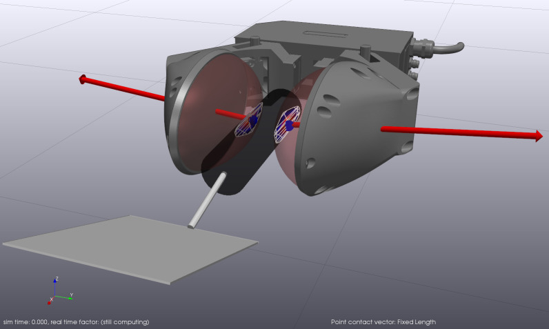
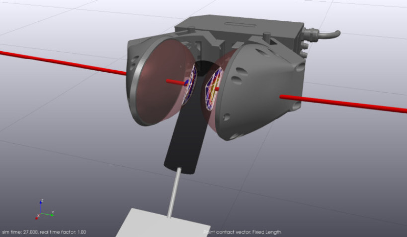
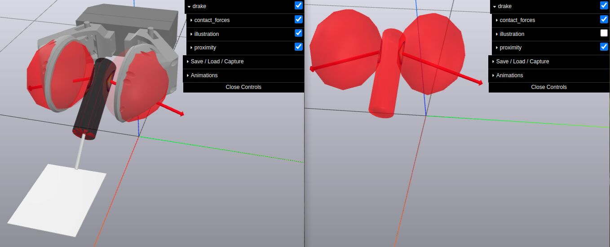

# Spatula Slip Control

This is an example of using the hydroelastic contact model with a
robot gripper with compliant bubble fingers and a compliant spatula handle.
This example is described in the paper
[Discrete Approximation of Pressure Field Contact Patches](https://arxiv.org/abs/2110.04157)
and a discussion of the example can be found in
[the accompanying video](https://youtu.be/TOsd5LAEPmU?t=85) at 1:25.
The example poses the spatula in the closed grip of the gripper and
uses an open loop square wave controller to perform a controlled
rotational slip of the spatula while maintaining the spatula in
the gripper's grasp. This demonstrates that the hydroelastic contact patch
captures important behavior missed in point contact -- in this case,
pressure-dependent torsional friction emerges naturally.

In the source code, this example shows how to set up bodies by loading SDFormat
files and also calling C++ APIs.




## Run the example

```
bazel run //examples/hydroelastic/spatula_slip_control:spatula_slip_control
```

Use the MeshCat URL from the console log messages for visualization. In
the example console output below, the last line contains the log message
with the MeshCat URL `http://localhost:7002`.

```
drake (master)$ bazel run //examples/hydroelastic/spatula_slip_control:spatula_slip_control
INFO: Analyzed target //examples/hydroelastic/spatula_slip_control:spatula_slip_control (0 packages loaded, 0 targets configured).
INFO: Found 1 target...
Target //examples/hydroelastic/spatula_slip_control:spatula_slip_control up-to-date:
  bazel-bin/examples/hydroelastic/spatula_slip_control/spatula_slip_control
INFO: Elapsed time: 0.428s, Critical Path: 0.00s
INFO: 1 process: 1 internal.
INFO: Build completed successfully, 1 total action
INFO: Running command line: bazel-bin/examples/hydroelastic/spatula_slip_control/spatula_slip_control
[2023-11-27 15:10:48.768] [console] [info] Meshcat listening for connections at http://localhost:7002
```

Please note that other examples may instruct users to run `meldis` for
visualization. However, this example recommends using the in-process MeshCat
URL from the log messages because it supports Animations playback (see the
section *Playback simulation* below). You can use `meldis` with this example,
but it will not show Animations playback when the simulation finishes.
Animations playback comes from code like this in
[spatula_slip_control.cc](https://github.com/RobotLocomotion/drake/blob/master/examples/hydroelastic/spatula_slip_control/spatula_slip_control.cc):
```C++
  meshcat->StartRecording();
  simulator.AdvanceTo(FLAGS_simulation_sec);
  meshcat->StopRecording();
  meshcat->PublishRecording();
```


## Illustration and Collision geometries

In Meshcat, you can view illustration geometries or 
collision (aka, proximity) geometries or both as shown
in the following picture.
Click on `illustration` or `proximity` as you wish.



## Playback simulation

After the simulation ends, it will publish the result for playback to Meshcat.
In Meshcat, you can use `Animations/play` or `pause` or `reset` to control 
the playback.

## Use polygon or triangle contact surfaces

This example provides the option for either triangulated or polygonal
contact surface representation. The polygonal representation of a contact
surface contains significantly fewer elements which in practice corresponds
to a more efficient simulation, though may produce unwanted artifacts when
working with very coarse meshes. By default, this example uses polygonal
contact surfaces. Refer to the
[Hydroelastic User Guide](https://drake.mit.edu/doxygen_cxx/group__hydroelastic__user__guide.html)
for more details about hydroelastic representations. You can also try a more
conventional point-contact model by specifying `--contact_model=point` on the
command line.

The option `--contact_surface_representation=triangle` specifies triangle
contact surfaces:

```
bazel run //examples/hydroelastic/spatula_slip_control:spatula_slip_control \
-- --contact_surface_representation=triangle
```

**WARNING**: Using a more dense contact surface representation may cause simulation
convergence failures. Using a smaller step size can help in convergence:

```
bazel run //examples/hydroelastic/spatula_slip_control:spatula_slip_control \
-- --contact_surface_representation=triangle --mbp_discrete_update_period=5e-3
```

**WARNING**: According to issue
[17681](https://github.com/RobotLocomotion/drake/issues/17681),
neither MeshCat nor Meldis can draw wireframe of the contact surfaces.
As a result, you cannot currently see the difference between the `triangle`
option and the default `polygon` option.

## Other Options

There are other command-line options that you can use. Use `--help` to see
the list. `gripper_force, amplitude, frequency, pulse_width, period` are all
parameters that affect the control signal of the gripper. It is tuned to show
a controlled slip where when the gripper is fully engaged the spatula is in
stiction. Turning down the `amplitude` parameter will affect when and if the
spatula is in stiction. Other options affect the parameters of the
MultibodyPlant running the dynamics as well as the Simulator running the
simulation.

```
bazel run //examples/hydroelastic/spatula_slip_control:spatula_slip_control \
-- --help
```
