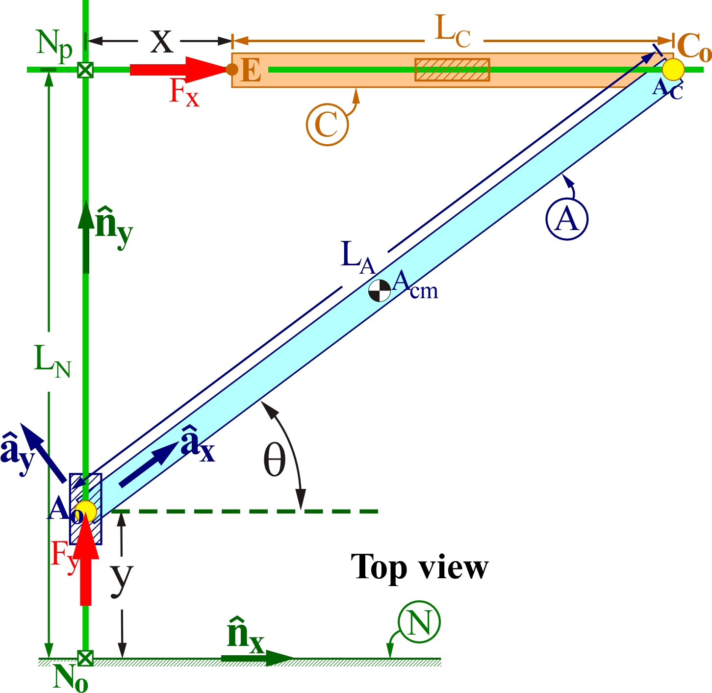

## Simulate motion of a robotic finger in a horizontal plane.

### Description

This robot has a rigid push-rod A that connects to the robot's base (world) with
a combination prismatic motor/revolute joint at point Ao of rod A. The prismatic
motor pushes Ao with a force of measure Fy. At the other end of rod A, point Ac
connects to point Co of rigid finger C by a frictionless revolute joint.
Finger C connects to the robot's base (world) by a frictionless prismatic joint.
(rod C can translate, but not rotate, relative to world.  The object being
grasped exerts a contact force with measure Fx on the robot's end-effector E
(E is at the end of finger C).

<p align="center">
  
</p>

1. One way to close the kinematic loop is to use a flexible bushing to
   More information on the bushing model being used is in
[linear_bushing_roll_pitch_yaw.h](https://drake.mit.edu/doxygen_cxx/classdrake_1_1multibody_1_1_linear_bushing_roll_pitch_yaw.html).

### Building and running this example

First complete the one-time setup instructions, if you have not already done so:
https://drake.mit.edu/from_source.html#mandatory-platform-specific-instructions

Open a terminal in the `drake` workspace, and type commands as shown below.

Build the example like so:
```
bazel build //tools:drake_visualizer //examples/multibody/bushing_as_revolute_joint
```

Run the example like so:
```
bazel-bin/tools/drake_visualizer &
bazel-bin/examples/multibody/bushing_as_revolute_joint/bushing_as_revolute_joint
```

Alternatively, to simulate for 8 seconds, pass command line arguments to the
executable by typing:
```
bazel-bin/examples/multibody/bushing_as_revolute_joint/bushing_as_revolute_joint -simulation_time=8 -simulator_max_time_step=2E-3
```

To see a list of all possible command-line arguments:
```
bazel-bin/examples/multibody/bushing_as_revolute_joint/bushing_as_revolute_joint -help
```
