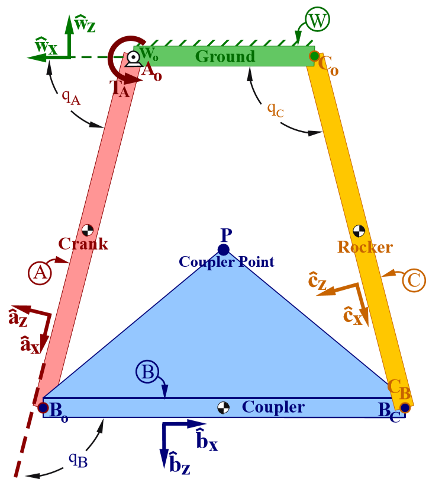
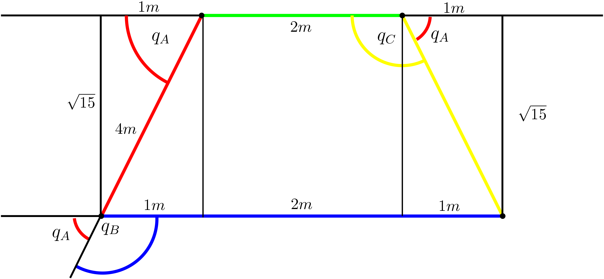

# Four-Bar Linkage Example
This planar four-bar linkage demonstrates how to use a bushing to
approximate a closed kinematic chain. It loads an SDF model from the
file "four_bar.sdf" into MultiBodyPlant. It handles the closed kinematic
chain by replacing one of the four-bar's revolute (pin) joints with a
bushing (`ForceElement::LinearBushingRollPitchYaw`) whose force
stiffness and damping values were approximated as discussed below.
An alternative way to close this four-bar's kinematic chain is to "cut"
one of the four-bar's rigid links in half and join those halves with a
bushing that has both force and torque stiffness/damping. Note: the links
in this example are constrained to rigid motion in the world X-Z
plane (bushing X-Y plane) by the 3 revolute joints specified in the
SDF. Therefore it is not necessary for the bushing to have force stiffness/damping
along the joint axis.

To run with default flags:

```
bazel run //examples/multibody/four_bar:passive_simulation
```

You should see the four-bar model oscillating passively with a small initial velocity.

To change the initial velocity of `joint_WA`, q̇A in radians/second :
```
bazel run //examples/multibody/four_bar:passive_simulation -- --initial_velocity=<desired_velocity>
```

You can also apply a constant torque, 𝐓ᴀ, to `joint_WA` with a command line argument:
```
bazel run //examples/multibody/four_bar:passive_simulation -- --applied_torque=<desired_torque>
```
The torque is applied constantly to the joint actuator with no feedback. Thus,
 if set high enough, you will see the system become unstable. 

You can change the bushing parameters from the command line to observe their effect on
the modeled joint. For instance, change `force_stiffness` to 300:
 ```
bazel run //examples/multibody/four_bar:passive_simulation -- --force_stiffness=300
```
And observe a gradual displacement between link *B* and link *C*.

Change `force_damping` to 0:
 ```
bazel run //examples/multibody/four_bar:passive_simulation -- --force_damping=0
```
And observe the joint oscillating.

Try setting `applied_torque` to 1000 and watch how the large forces interact with the bushing stiffness.


## Four-bar linkage model

The figure below shows a planar four-bar linkage consisting of 
frictionless-pin-connected uniform rigid links *A, B, C* and ground-link *W*.
- Link *A* connects to *W* and *B* at points *A*ₒ and *B*ₒ
- Link *B* connects to *A* and *C* at points *B*ₒ and *B*c
- Link *C* connects to *W* and *B* at points *C*ₒ and *C*ʙ

Right-handed orthogonal unit vectors **Âᵢ B̂ᵢ Ĉᵢ Ŵᵢ** 
(*i = x,y,z*) are fixed in *A, B, C, W,* with:
- **Â**𝐱 directed from *A*ₒ to *B*ₒ
- **B̂**𝐱 directed from *B*ₒ to *B*c
- **Ĉ**𝐱 directed from *C*ₒ to *C*ʙ
- **Ŵ**𝐳 vertically-upward.
- **Â**𝐲 = **B̂**𝐲 = **Ĉ**𝐲 = **Ŵ**𝐲 parallel to pin axes

| Diagram of the four bar model described above. |
| :---: |
|     |
|  |

|                     Quantity                      |        Symbol       |   Value   |
| ------------------------------------------------- | ------------------- | --------- |
| Distance between *W*ₒ and *C*ₒ                    |          𝐋ᴡ        |    2 m    |
| Lengths of links *A, B, C*                        |         *L*         |    4 m    |
| Masses of *A, B, C*                               |         *m*         |   20 kg   |
| Earth’s gravitational acceleration                |         *g*         | 9.8 m/s²  |
|                                                   |                     |           |
| **Ŵ**𝐲 measure of motor torque on *A*             |          𝐓ᴀ        | Specified |
| Angle from **Ŵ**𝐱 to **Â**𝐱 with a +**Ŵ**𝐲 sense |          𝐪ᴀ         | Variable  |
| Angle from **Â**𝐱 to **B̂**𝐱 with a +**Â**𝐲 sense |          𝐪ʙ         | Variable  |
| Angle from **Ŵ**𝐱 to **Ĉ**𝐱 with a +**Ŵ**𝐲 sense |          𝐪ᴄ         | Variable  |
|                                                   |                     |           |
| "Coupler-point" *P*'s position from *B*ₒ          |         2 **B̂**𝐱 - 2 **B̂**𝐳     |

With 𝐓ᴀ = 0, the equilibrium values for the angles are:
𝐪ᴀ ≈ 75.52°, 𝐪ʙ ≈ 104.48°, 𝐪ᴄ ≈ 104.48°.

## Starting Configuration

The SDF defines all of the links with their x axes parallel to the world x
axis for convenience of measuring the angles in the state of the system
with respect to a fixed axis. Below we derive a valid initial configuration
of the three angles 𝐪ᴀ, 𝐪ʙ, and 𝐪ᴄ.

| Derivation of starting configuration |
| :---: |
|     |
| |

Due to equal link lengths, the initial condition (static equilibrium) 
forms an isosceles trapezoid and initial values can be determined from
trigonometry. 𝐪ᴀ is one angle of a right triangle with its adjacent
side measuring 1 m and its hypotenuse measuring 4 m.  Hence, initially
𝐪ᴀ = tan⁻¹(√15) ≈ 1.318 radians ≈ 104.48°.

Because link *B* is parallel to **Ŵ**𝐱, 𝐪ᴀ and 𝐪ʙ are supplementary,
hence the initial value is 𝐪ʙ = π - 𝐪ᴀ ≈ 1.823 radians ≈ 75.52°.
Similarly, 𝐪ᴀ and 𝐪ᴄ are supplementary, so initially 𝐪ᴄ = 𝐪ʙ. 

# Modeling the revolute joint between links B and C with a bushing

In this example, we replace the pin joint at point **Bc** (see diagram)
that connects links *B* and *C* with a 
`ForceElement::LinearBushingRollPitchYaw`(there are many other uses of a 
bushing).  We model a z-axis revolute joint by setting torque stiffness 
constant k₂ = 0 and  torque damping constant d₂ = 0.  We chose the 
z-axis (Yaw) to avoid a singularity associated with "gimbal lock". 
Two frames (one attached to *B* called `Bc_Bushing` with origin at point 
**Bc** and one attached to *C* called `Cb_Bushing` with origin at point 
**Cb**) are oriented so their z-axes are perpedicular to the planar 
four-bar linkage.

## Estimating bushing parameters
Joints are normally modeled with hard constraints except in their motion 
direction, and three of the four revolute joints here are indeed modeled 
that way. However, in order to close the kinematic loop we have to use a 
bushing as "penalty method" substitute for hard constraints. That is, because 
the bushing is compliant it will violate the constraint to some degree. The 
stiffer we make it, the more precisely it will enforce the constraint but 
the more difficult the problem will be to solve numerically. We want to 
choose stiffness k and damping d for the bushing to balance those 
considerations. First, consider your tolerance for constraint errors -- if 
the joint allows deviations of 1mm (say) would that be OK for your application?
Similarly, would angular errors of 1 degree (say) be tolerable? We will give 
a procedure below for estimating a reasonable value of k to achieve a 
specified translational and rotational tolerance. Similarly, we need to choose
d to damp out oscillations caused by the stiff spring in a "reasonable" time.
Consider a time scale you would consider negligible. Perhaps a settling time
of 1ms (say) would be ignorable for your robot arm, which presumably has
much larger time constants for important behaviors. We will give a 
procedure here for obtaining a reasonable d from k and your settling 
time tolerance.

## Estimate force stiffness [kx ky kz] from loading/displacement
The bushing's force stiffness constants [kx ky kz] can be 
approximated via various methods (or a combination thereof).
For example, one could specify a maximum bushing displacement in a
direction (e.g., xMax), estimate a maximum directional load (Fx) that
combines gravity forces, applied forces, inertia forces (centripetal,
Coriolus, gyroscopic), and then calculate kx ≈ Fx / xMax.  


## Estimate force stiffness [kx ky kz] constants from mass and ωₙ
The bushing's force stiffness constants [kx ky kz] can be
approximated via a related linear constant-coefficient 2ⁿᵈ-order ODE:

|  |  |
| ----- | ---- |
|   m ÿ  +      b ẏ  +    k y = 0   | or equivalently
|   m ÿ  + 2 ζ ωₙ ẏ  +  ωₙ² y = 0   | where ωₙ² = k/m,  ζ = b / (2 √(m k))

Values for k can be determined by choosing a characteristic mass m
(which may be directionally dependent) and then choosing ωₙ.
One way to pick ωₙ is to choose a settling_time which approximates the
desired time for the bushing to settle to within 5% of an equilibrium
solution, use ωₙ ≈ 5 / settling_time, and then k ≈ m ωₙ².

## Effect of stiffness [kx ky kz] on simulation time and accuracy
Generally, a stiffer bushing more closely resembles an ideal revolute 
joint. However (depending on integrator) a stiffer bushing increase 
numerical integration time.

## Estimate force damping [dx dy dz] from mass and stiffness 
Once m and k have been chosen, damping d can be estimated by picking a
damping ratio ζ (e.g., ζ ≈ 1, critical damping), then d ≈ 2 ζ √(m k).

## Estimating torque stiffness [k₀ k₁ k₂] and damping [d₀ d₁ d₂]
The bushing in this planar example replaces a revolute joint, hence no
torque stiffness or torque damping is needed.  An alternative way to
deal with this four-bar's closed kinematic loop is to "cut" one of the 
four-bar's rigid links in half and join those halves with a bushing
that has both force and torque stiffness/damping.  If this technique
is used, torque stiffness is needed.  One way to approximate torque
stiffness is with concepts similar to the force stiffness above.
For example, the bushing's torque stiffness k₀ could be calculated 
by specifing a maximum bushing angular displacement θₘₐₓ, estimating
a maximum moment load Mx and calculating k₀ = Mx / θₘₐₓ.
Alternatively, a value for k₀ can be determined by choosing a 
characteristic moment of inertia I₀ (which is directionally dependent)
and then choosing ωₙ (e.g., from setting_time), then using k₀ ≈ m ωₙ².
With k₀ available and a damping ratio ζ chosen, b ≈ 2 ζ √(I₀ k₀).
