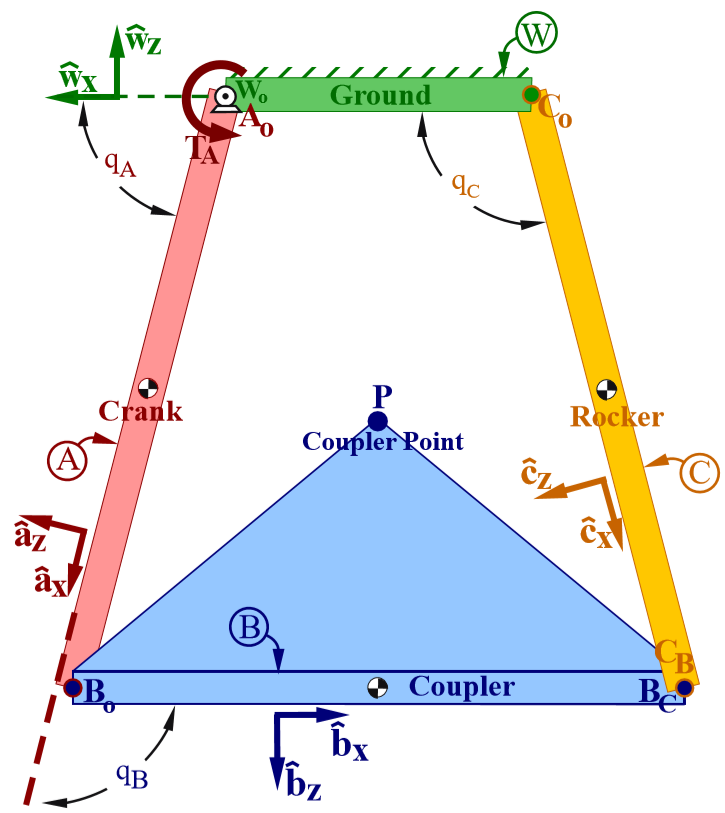
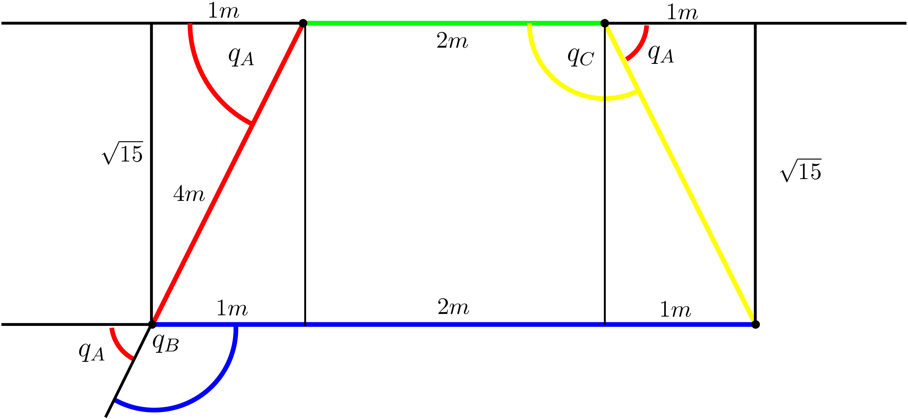

# Four Bar Linkage Example
> This example demonstrates loading a single SDF model into a generic
> `MultiBodyPlant`. The model is a simple four bar linkage. This example also
> demonstrates modeling a closed loop kinematic chain by replacing one of the
> revolute joints in the four bar with a `LinearBushingRollPitchYaw
>` `ForceElement`.

| Diagram of the four bar model found in `four_bar.sdf` |
| :---: |
|     | 
|  | 

## Starting Configuration

> The SDF defines all of the links with their x axes parallel to the world x
> axis for convenience of measuring the angles in the state of the system
> with respect to a fixed axis. Below we derive a valid initial configuration
> of the three angles `q_A`, `q_B`, and `q_C`. 

| Derivation of starting configuration |
| :---: |
|     | 
| | 

Because of the congruity of the link lengths, this initial condition is very
symmetric, and forms an isosceles trapezoid. `q_A` is one angle of a right
triangle with its adjacent side measuring 1m and hypotenuse measuring 4m. We
can immediately calculate `q_A` as `atan2(sqrt(15), 1)`.  
 
 Because link B is parallel with the `W_x` axis, `q_A` and `q_B` are
 supplementary, and thus we can set `q_B = M_PI - q_A`.
  
For a similar symmetric argument, the same triangle is formed on the right
 side of the trapezoid. Making `q_A` and `q_C` supplementary and thus `q_C
  = M_PI - q_A` 
  
## Modelling a revolute joint

In this example, we remove the joint at point **Bc** in the diagram that
would usually connect link **B** to link **C**. To accomplish this we use a
`LinearBushingRollPitchYaw` `ForceElement` placed at the joint. One of the
many uses of this bushing element is to model a revolute joint. We module a z
-axis revolute joint by setting the torque stiffness (k₂) and torque damping
(d₂) constants to 0. We choose the z axis (Yaw) to avoid gimbal lock. Two
frames (one attached to **B** with origin at point **Bc** and one attached to
**C** with origin at point **Cb**) are placed such that their z axes point
 out of the paper in the above diagram. 