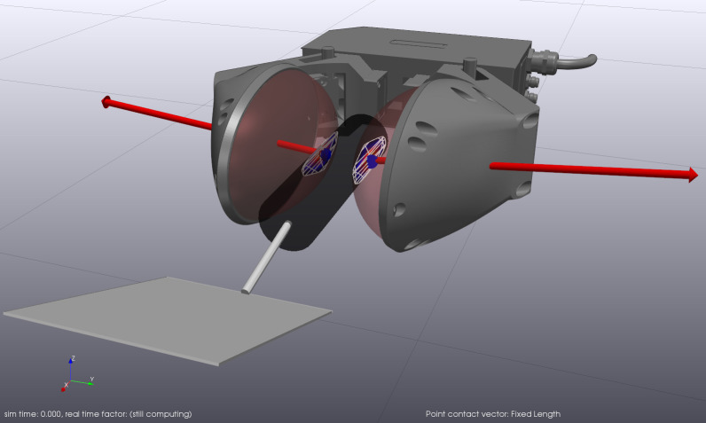
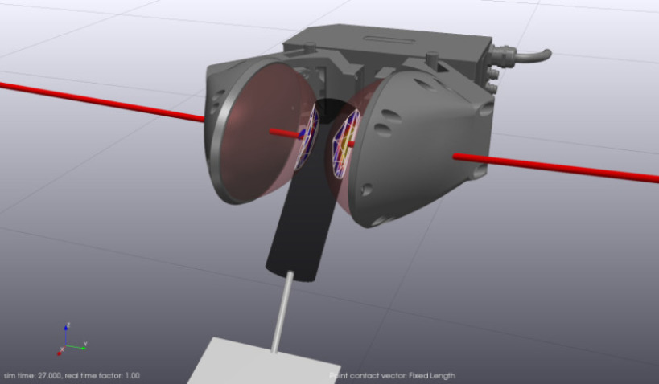

# Spatula Slip Control

This is an example of using the hydroelastic contact model with a
robot gripper with compliant bubble fingers and a compliant spatula.
The example poses the spatula in the closed grip of the gripper and
uses an open loop square wave controller to perform a controlled
rotational slip of the spatula while maintaining the spatula in
the gripper's grasp.

In the source code, this example shows how to set up bodies by loading SDFormat
files and also calling C++ APIs.




## Run DrakeVisualizer

```
bazel run //tools:drake_visualizer
```

In `Plugins > Contacts > Configure Hydroelastic Contact Visualization` you
might want to set these:

* Maximum pressure = 1.5e4
* Vector scaling mode = Scaled
* Global scale of all vectors = 0.05

## Run the example

```
bazel run //examples/multibody/spatula_slip_control:spatula_slip_control
```

## Use polygon or triangle contact surfaces

By default, this example uses polygon contact surfaces.

The option `--contact_surface_representation=triangle` specifies triangle
contact surfaces:

```
bazel run //examples/multibody/spatula_slip_control:spatula_slip_control \
-- --contact_surface_representation=triangle
```

## Other Options

There are other command-line options that you can use. Use `--help` to see
the list. `gripper_force, amplitude, frequency, pulse_width, period` are all
parameters that affect the control signal of the gripper. It is tuned to show
a controlled slip where when the gripper is fully engaged the spatula is in
stiction. Turning down the `amplitude` parameter will affect when and if the
spatula is in stiction. Other options affect the parameters of the
MultibodyPlant running the dynamics as well as the Simulator running the
simulation.

```
bazel run //examples/multibody/spatula_slip_control:spatula_slip_control \
-- --help
```
