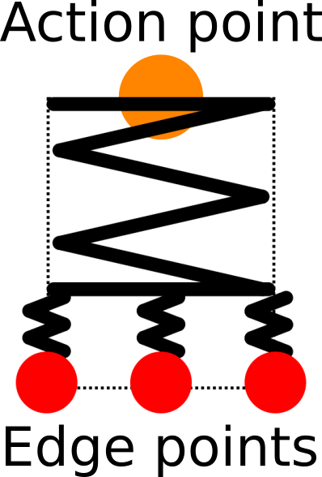
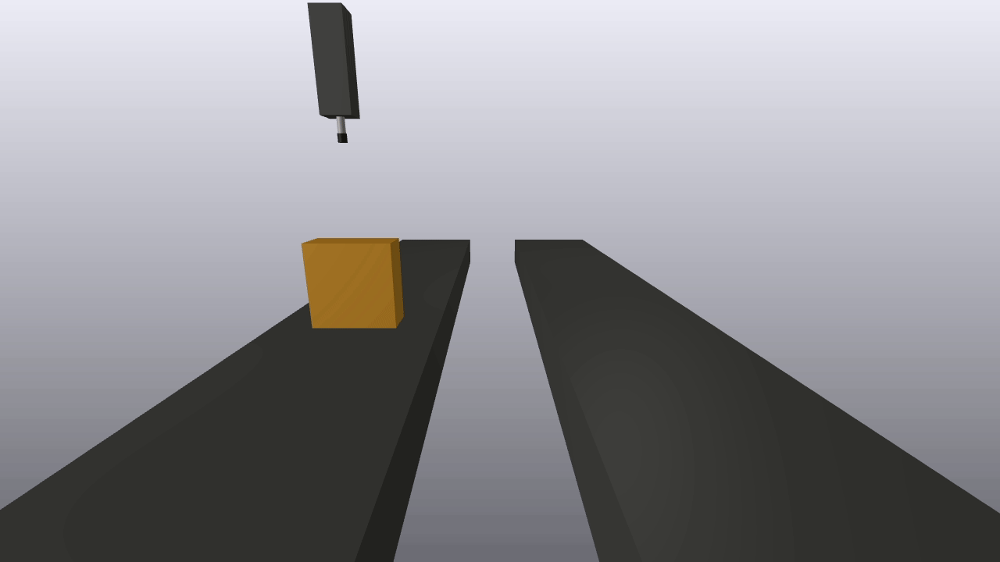
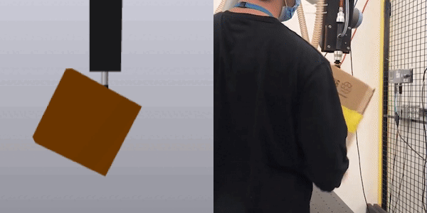
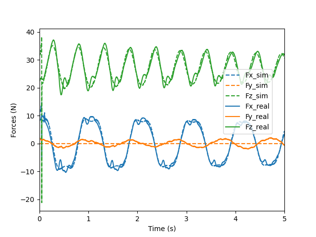
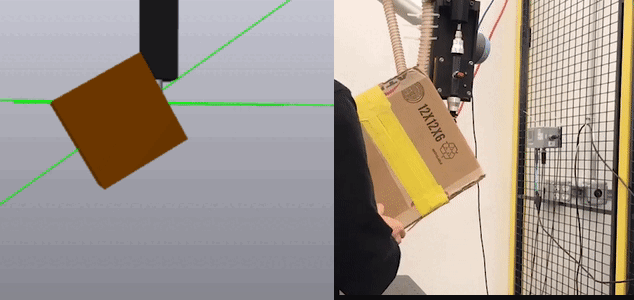
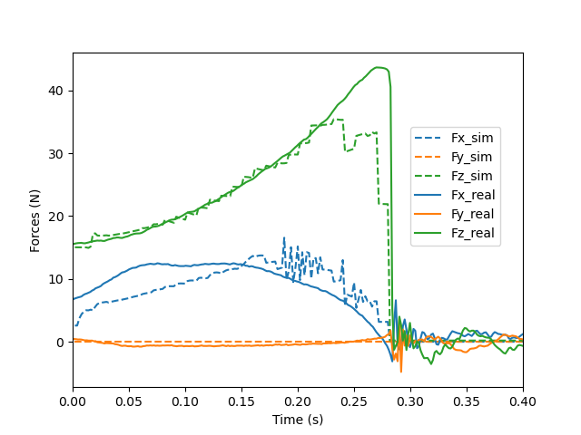

# Suction Gripper
This example demos a suction gripper modeled as follows:
* The suction cup is modeled as a combination of serial and parallel springs shown in the picture below, where the "action point" is a sphere to apply forces and "edge points" are spheres to check the sealing.

<p align="center">

</p>

* The suction force is modeled as a pair of [ExternallyAppliedSpatialForce](https://drake.mit.edu/doxygen_cxx/structdrake_1_1multibody_1_1_externally_applied_spatial_force.html), which is a function of the cup-object distance.


## Demo 1: Pick and Place
Run the demo:
```
bazel run //tools:meldis -- --open-window &
```
```
bazel run //examples/multibody/suction_gripper:pick_and_place
```
<p align="center">

</p>

## Demo 2: Package Swing
Run the periodic swing demo:
```
bazel run //tools:meldis -- --open-window &
```
```
bazel run //examples/multibody/suction_gripper:package_swing -- --initial_angle=0.7854
```
<p align="center">

</p>

Cup reaction force sim vs. real:
<p align="center">

</p>


Run the peel off demo:
```
bazel run //tools:meldis -- --open-window &
```
```
bazel run //examples/multibody/suction_gripper:package_swing -- --initial_angle=1.0472
```
<p align="center">

</p>

Cup reaction force sim vs. real:
<p align="center">

</p>